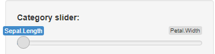
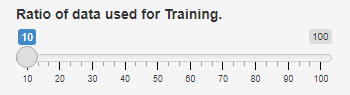

```{r setup, include=FALSE}
knitr::opts_chunk$set(echo = FALSE)
```

Summary
========================================================
This project was part of the coursera course **Data Science Developing Data Products**. In 
this project a Shiny app was developed which takes the data from the **iris** dataset and
depending on the input from the user divides the data into different ratios of training and 
testing data. This data was then used to train and predict on a Linear Discriminant model.

Category Slider
========================================================


This slider lets you choose off which category the training and testing data will be based on.
The list of categories to choose from is listed below:

- Sepal.Length    
- Sepal.Width     
- Petal.Length    
- Petal.Width

Ratio Slider
========================================================


This slider lets you choose the ratio or percentage of the iris data used to build the training set. 
The values ranges between 10% to 100% and steps in 10%.

Train Button
========================================================


This button executes the training and prediction, which displays a graph TRUE and False predictions. 
A Confusion Matrix results are also displayed beneath the graph. 

```{r, error=FALSE,message=FALSE}
library(plotly)
library(shiny)
library(caret)
library(stats)
library(ggplot2)
library(e1071)

set.seed(123456)
    CurrentCategory <- colnames(iris)[1]
    data <- 0
    Partition <- 0
    Training <- 0
    Testing <- 0
    ratio <- 0.1
    
    trainC <- trainControl(method = "cv", number = 5, allowParallel = T)

    data <- data.frame("Species"=iris[,"Species"] ,"Cat"=iris[,1])
    Partition <- createDataPartition(y = data$Species,p = ratio,list = FALSE)
    Training <- data.frame( data[Partition,])
    Testing <- data.frame(data[-Partition,])
    
    modFit_lda <- train(Species~.,method = "lda" ,data = Training, trControl = trainC)
    
    predict_lda <- predict(modFit_lda,Testing)
    
    eqPred <- (predict_lda==Testing$Species)
    
    plotData<- data.frame("Prediction" = predict_lda, "Actuals" = Testing$Species)

    scatter <- ggplot(plotData, aes(x = Prediction, y = Actuals, color = eqPred)) + 
    geom_point()
    
    ggplotly(p = scatter, type = 'scatter')
    
    confusionMatrix(predict_lda, as.factor(Testing$Species))
```
